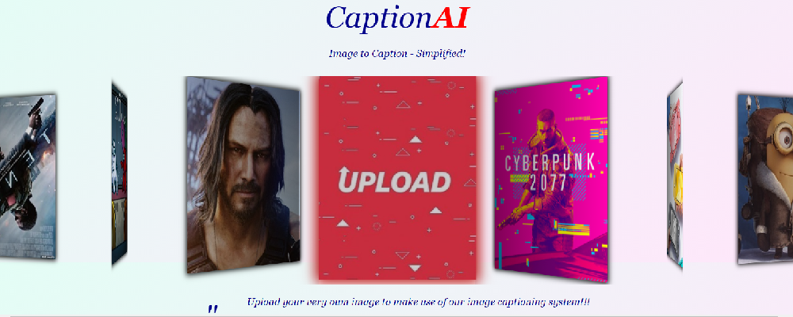

# iCap (Image-Captioner)

_iCap is an image captioning tool that incorporates machine learning to derive captions for images uploaded to the application. This application leverages **Flask** for handling the back-end request processing and the **React** framework for a fulfilling front-end user experience._

## Getting Started

After cloning the project, enter the project's main directory (`image-captioner`) and type the following command in the terminal to download and enable multiple **npm** scripts execution in **Node**:

`npm install npm-run-all --save-dev`

The **Node** scripts in this project have been modified to download all **Python** and **Node** dependencies automatically. Type the following command in the terminal to download all dependencies:

`npm run dependencies`

Subsequently, to start the application, you can run the Flask and React servers simultaneously with the following command:

`npm run dev`

Now, you can upload images and acquire the captions generated by our machine-learning model.

## Credits

This project was a collaborative effort for the **IEEE Techathlon 2020** workshops where we sought to empower and educate inquisitive minds with our code.

#### Machine-Learning

- [Ritik Bhatia](https://github.com/ritikbhatia)
- [Swathi](https://github.com/swakv)

#### Back-End

- [Amrita Ravishankar](https://github.com/amritaravishankar)
- [Harsh Doddannavar](https://github.com/Harsh3563)

#### Front-End

- [Akshit Kumar](https://github.com/swankyhacker)
- [Ashwin Pande](https://github.com/ashwin2201)
